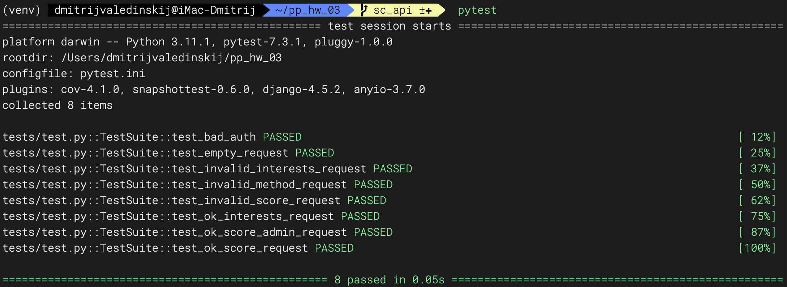
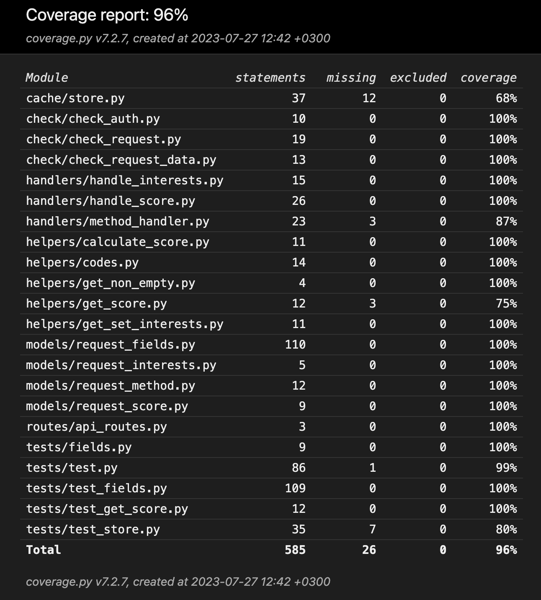
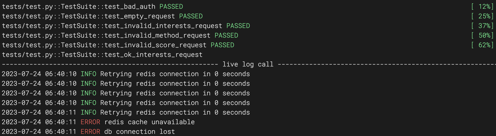

## ДЗ №3

### Scoring API: выполнено.

Как использовать приложение:

```commandline
 python api.py --help
```

```text
usage: api.py [-h] [-p PORT] [-l LOG]

server port, log file setup

options:
  -h, --help            show this help message and exit
  -p PORT, --port PORT
  -l LOG, --log LOG
```

При запуске можно указать порт и путь к log-файлу.
В противном случае  порт сервера по умолчанию 8080, лог в stdout.

Работа API соответствует ТЗ, тесты пройдены:

[](images/img_01.png)

Себе на заметку: при валидации нужно учитывать

```code
var = 0
if var: # erroneous result due to falsy value; var is not empty
```

### Testing API: выполнено.

Перед тестированием выполнен рефакторинг предыдущего кода по замечаниям Даниила Щипко:
- устранено дублирование кода: commit a47d2a7
- валидация вынесена в @staticmethod, @property: commit 5a80235

Кэш и имитация базы данных - redis storage: cache/store.py.
Функция r_connect обеспечивает 5 последовательных попыток соединения с redis через линейно возрастающий интервал времени;
cache_set - запись в кэш, cache_get - чтение из кэша; store_get - имитирует обращение к БД.
При недоступном кэше алгоритм пересчитывает значение, store_get возвращает сообщение о недоступности БД.

За рамками ТЗ подразумевается наличие таблиц серии clients, где присутствуют cid, clients_interests.
У нас cid возникает "из воздуха", данные clients_interests симулируются и записываются в redis storage.

helpers/get_set_interests.py
```python
def set_interests(cid):
    """Sets client's preferences list in a random manner since the action is not specified"""

    key = f"i:{cid}"

    interests = [
        "cars",
        "pets",
        "travel",
        "hi-tech",
        "sport",
        "music",
        "books",
        "tv",
        "cinema",
        "geek",
        "otus",
    ]
    client_interests = json.dumps(random.sample(interests, 2))

    cache_set(key=key, expire=60 * 60, value=client_interests)
```
Таким образом имитируется существование в  БД cid: client_interests.

#### Тестирование

Тестирование выполнено с использованием pytest.
Параметризация @pytest.mark.parametrize.

Тесты разделены на две группы: integration, unit.
В качестве интеграционных используются тесты Ступникова, запущенные с помощью handlers.method_handler.
Единственное изменение исходного кода - helpers.get_set_interests.py:
 ```python
 def get_interests(cid):
    """Returns list of client's preferences from imitated db storage"""

    res = store_get(f"i:{cid}")
    # return else [""] imitates client exists and db OK
    # Stupnikov's else [] -> else[""] to modify test_ok_interests_request behaviour
    return json.loads(res) if res else [""]
 ```
Модульные тесты:
- unit/test_fields.py - проверяют результат валидации полей запроса в соответсвии с ТЗ.
- unit/test_store.py - проверяет работу кэша (БД)
- unit/test_get_store.py - проверяет работу алгоритма подсчета score.

[](images/img_02.png)

96% покрытия - результат следования условиям ТЗ; не являлось самоцелью.
Большое количество test cases (100) - следствие большого количества ограничений, установленных ТЗ.

Тестирование выполняется как с поднятым кэшем, так и без него: pytest-redis.yml, pytest.yml.
В обоих случаях код проходит тесты с поведением, соответсвующим ТЗ.
Полный цикл ожидания (5 запросов) соединения занимает 1 секунду:

[](images/img_03.png)

Все тесты в отсутствие redis выполняются приблизительно за 70-80 секунд.
С redis - 0,2 секунды.
